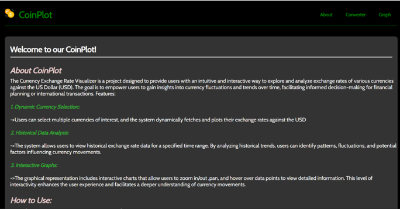
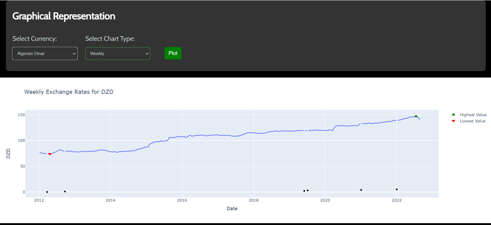
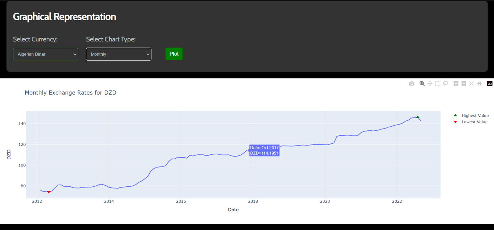
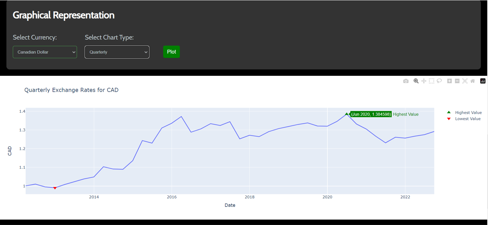
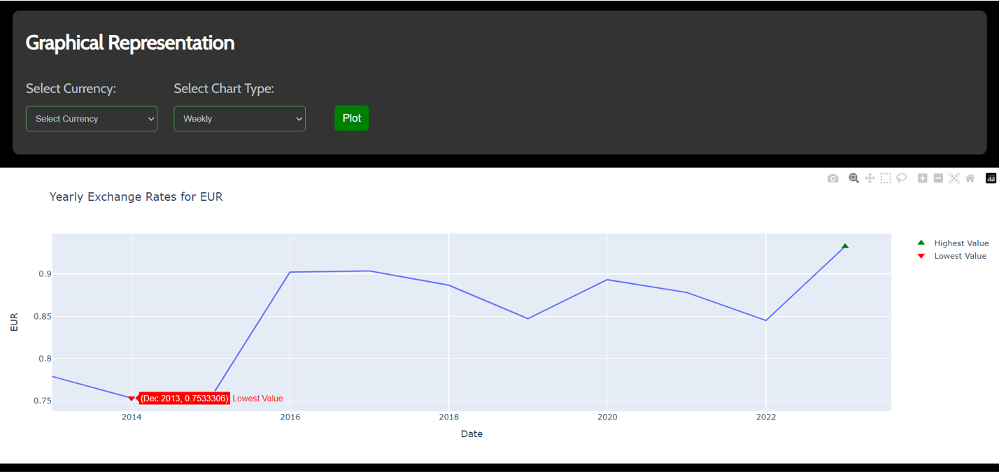

# MITWPU-20-CoinPlot

## Introduction
Developed by our team as part of the internship recruitment process for Northern Trust.
The Currency Exchange Rate Visualizer (CoinPlot) is a project designed to provide users with an intuitive and interactive way to explore and analyze exchange rates of various currencies against the US Dollar (USD).
The goal is to empower users to gain insights into currency fluctuations and trends over time, facilitating informed decision-making for financial planning or international transactions.

## Table of Contents

#  [CoinPlot](#project-name)
  - [Table of Contents](#table-of-contents)
  - [Introduction](#introduction)
  - [Features](#features)
  - [Installation](#installation)

## Features

Navigation:

- Navbar for easy navigation.
- Quick navigation links in the footer.
- Informational Sections:

Currency Converter:
- Allows users to input an amount in USD.
- Select a currency pair.
- Displays the converted amount in the selected currency.

Graphical Representation:
- Dynamic graph plotting with interactive features.
- Users can select a currency pair and chart type to view historical exchange rates.

Footer:
- Quick navigation links.
- Social media links.

Styling:
- Stylish and responsive design.
- Consistent use of colors, fonts, and images.

Scripting:
- Use of jQuery for DOM manipulation.
- Integration with Plotly for dynamic graph plotting.

Historical Data Analysis:
- Users can analyze historical exchange rate data for a specified time range.

### Installation

### Prerequisites

Make sure you have the following installed:

- [Python](https://www.python.org/downloads/)
- [Git](https://git-scm.com/book/en/v2/Getting-Started-Installing-Git)

```bash
pip install django
pip install plotly
pip install pandas
```

```bash
# Example installation steps
git clone https://github.com/Arnavshah25/MITWPU-20-CoinPlot
cd coinplot_project
python manage.py runserver
```

The application will be accessible at http://127.0.0.1:8000/ in your web browser.

## Screenshots

- Homepage
  
  

- Converter
  
  

- Graph Representations
  
  

  

  

  

  

